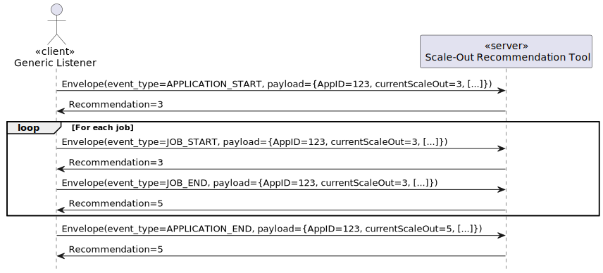
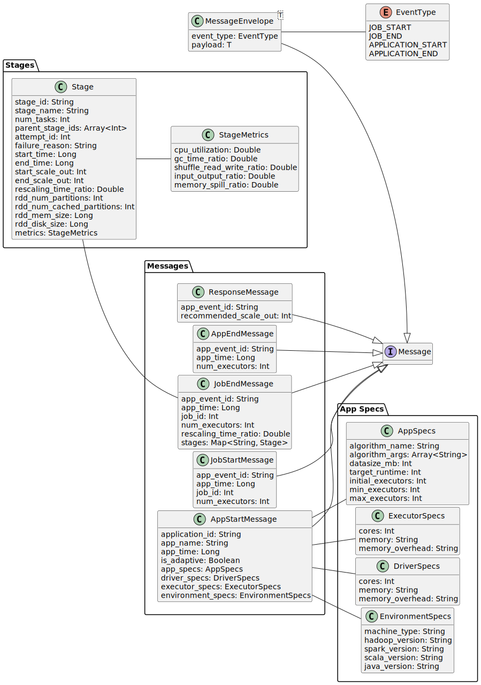

A generic spark listener which emits messages on spark events via a [ZeroMQ](https://zeromq.org/) socket. The listener is meant to talk to a runtime prediction/auto-scaling tool (like [Enel](https://ieeexplore.ieee.org/document/9679361) or [Ellis](https://ieeexplore.ieee.org/document/8241102)) which uses the runtime data info contained in the listener's emitted events to calculate an optimal scale-out for meeting a pre-defined runtime target of a Spark application.

```yaml
# Add via "spark.extraListeners" in your SparkApplication definition
sparkConf:
  "spark.extraListeners": "de.tu_berlin.jarnhold.listener.CentralizedSparkListener"
# The listener expects a range of properties to be set
"spark.customExtraListener.isAdaptive": "{{ is_adaptive }}"
"spark.customExtraListener.bridgeServiceAddress": "{{ bridge_service_address }}"
"spark.customExtraListener.minExecutors": "{{ min_executors }}"
"spark.customExtraListener.maxExecutors": "{{ max_executors }}"
```

The corresponding prediction/auto-scaling tool implementation must adhere to the following API:



The generic listener (the client) sends message envelopes, where an envelope contains an event type enum value, 
representing one of four application phases (APPLICATION START, JOB START, JOB END, APPLICATION END), and a payload, 
representing the corresponding message. The event type let’s the scale-out recommendation tool (the server) determine 
which kind of message the payload represents. The server is expected to handle incoming events in an arbitrary order, 
meaning that it should be capable of handling multiple applications running concurrently. On each incoming message, the
server shall return a response message containing the ID and a scale-out recommendation for the respective app. 
This decision was made in order to maintain the simplicity of the messaging API by utilizing a consistent schema for 
all response messages. However, it is not logical to return a recommended scale-out on application end. Given that each 
incoming message contains the current scale-out of the application, the server is not expected to calculate a scale-out
every time, but instead can just return the current scale-out as is. The generic listener will continuously monitor the 
current amount of executors and only communicate with the resource manager and adjust the amount of executors if the 
recommended scale-out is not equal to the current scale-out.



For more detailed information, see the related [master thesis](https://github.com/jnsrnhld/masterthesis-latex).
